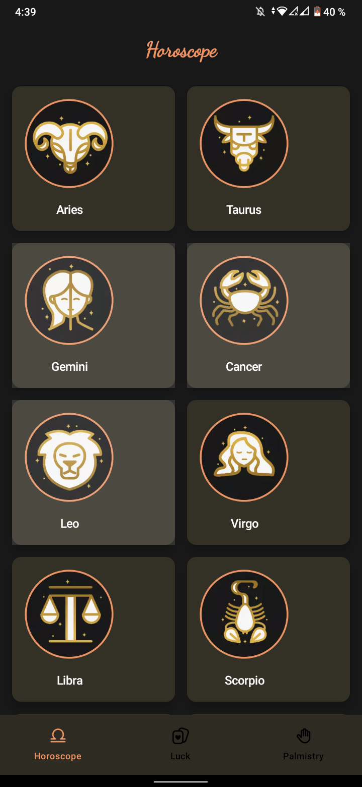
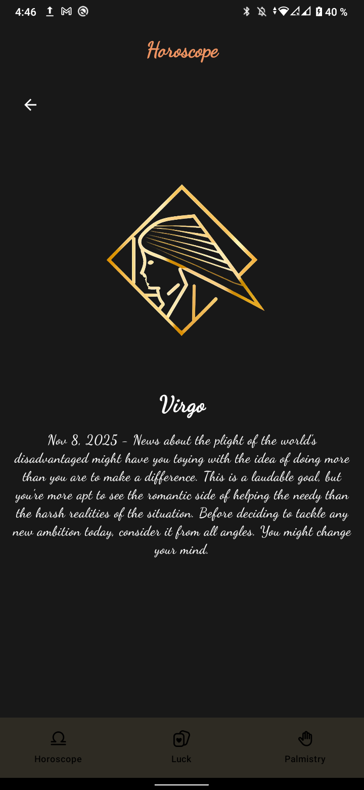
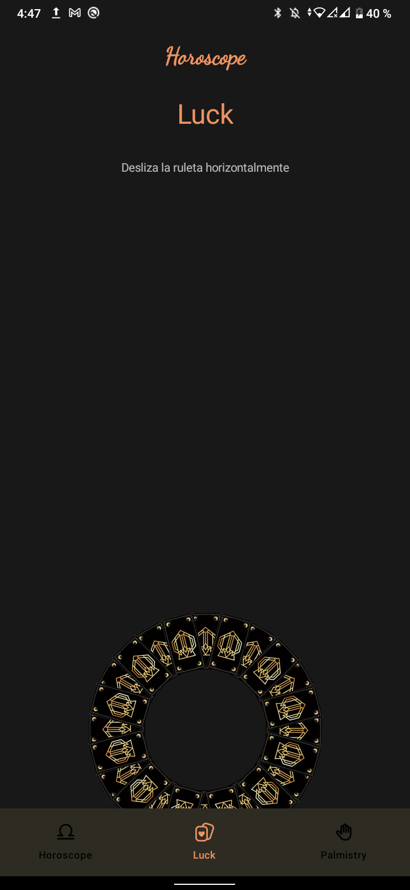
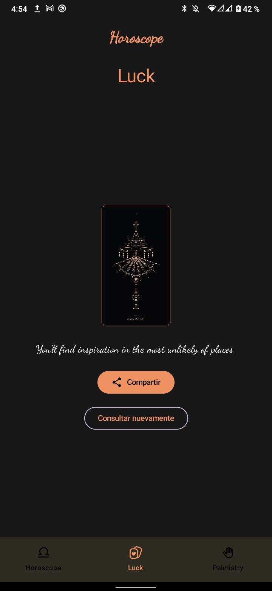
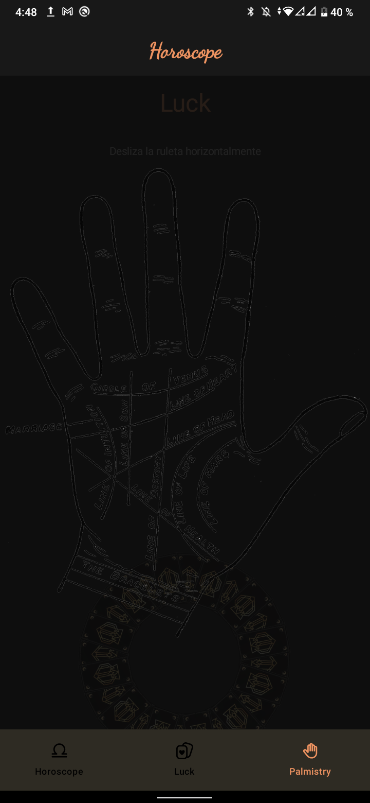

# 🔮 Horoscope App - Jetpack Compose

Una aplicación moderna de astrología desarrollada completamente en **Jetpack Compose** que ofrece horóscopos diarios, lecturas de tarot y quiromancia a través de la cámara.

## 📱 Características

### 🌟 Horóscopos Diarios
- Visualización de los 12 signos del zodiaco con animaciones fluidas
- Consulta de predicciones diarias a través de API REST
- Navegación intuitiva con animación de rotación al seleccionar un signo
- Predicciones personalizadas para cada signo zodiacal

### 🎴 Lectura de Tarot (Luck)
- Ruleta interactiva con gestos de deslizamiento horizontal
- Animaciones suaves de rotación, deslizamiento y escalado
- 32 cartas del tarot con predicciones únicas
- Función de compartir predicción en redes sociales
- Opción de consultar nuevamente

### 🤚 Quiromancia (Palmistry)
- Integración con CameraX para vista en tiempo real
- Overlay translúcido con diagrama de líneas de la mano
- Guía visual para comparar las líneas de la palma
- Manejo de permisos de cámara con Accompanist

## 🎨 Capturas de Pantalla

  
  
  
  
  

### 🌟 Pantalla Principal - Signos del Zodiaco

Muestra los 12 signos del zodiaco en un **LazyVerticalGrid** con diseño responsive. Al hacer clic en cualquier signo:
- Se ejecuta una **animación de rotación de 360°** usando `Animatable`
- Navega a la pantalla de detalle pasando el tipo de signo como parámetro
- Cada carta tiene elevación y efectos visuales con Material Design 3

**Tecnologías**: Jetpack Compose, Navigation Compose, Kotlin Coroutines

 

---

### 📅 Detalle del Horóscopo - Integración con API

Realiza una **llamada asíncrona a la API REST** mediante Retrofit para obtener la predicción diaria:
- **Endpoint**: `GET /horoscope/{sign}`
- **Autenticación**: Header con token personalizado mediante `AuthInterceptor`
- **Mapeo automático**: De `PredictionResponse` (DTO) a `PredictionModel` (Dominio)
- **Manejo de estados**: Loading, Success, Error con StateFlow
- Cada signo recibe una predicción única actualizada diariamente
- Arquitectura limpia: UseCase → Repository → ApiService

**Tecnologías**: Retrofit, OkHttp, Gson, Hilt, MVVM

 

---

### 🎰 Ruleta de la Suerte - Inicio de Lectura

Interfaz interactiva con **detección de gestos horizontales**:
- **Gesto**: Desliza horizontalmente sobre la ruleta para activarla
- **Animación de rotación**:
   - Duración: 2000ms con `FastOutSlowInEasing`
   - Rotación: 4 vueltas completas (1440°) + grados aleatorios (0-360°)
   - Implementada con `Animatable` para suavidad
- **Indicador visual**: Texto instructivo "Desliza la ruleta horizontalmente"
- La ruleta está posicionada en `BottomCenter` con offset para sobresalir del área

**Tecnologías**: Compose Gestures, Animation API, detectHorizontalDragGestures

 

---

### 🎴 Predicción del Tarot - Resultado de Lectura

Después de girar la ruleta, se ejecuta una secuencia de animaciones:

1. **Animación de carta reversa** (`card_back_small`):
   - Deslizamiento desde abajo: `translationY` de 1000f a 0f (800ms)
   - Efecto de crecimiento: `scale` de 0f a 1f (500ms)
   - Usa `graphicsLayer` para transformaciones eficientes

2. **Transición fade**:
   - Preview desaparece: `alpha` 1f → 0f (200ms)
   - Predicción aparece: `alpha` 0f → 1f

3. **Muestra predicción**:
   - Carta del tarot seleccionada aleatoriamente de 32 opciones
   - Texto interpretativo personalizado para cada carta
   - Botón **"Compartir"** con `Intent.ACTION_SEND` para redes sociales
   - Botón **"Consultar nuevamente"** para reset

**Tecnologías**: Compose Animations, StateFlow, RandomCardProvider, Android Intents

 

---

### 🤚 Quiromancia - Lectura de Palma

Utiliza **CameraX** para análisis de la mano en tiempo real:

- **Vista previa de cámara**:
   - Cámara trasera con `CameraSelector.DEFAULT_BACK_CAMERA`
   - `PreviewView` integrado en Compose mediante `AndroidView`
   - Ciclo de vida vinculado al `LifecycleOwner`

- **Overlay translúcido**:
   - Capa semitransparente negra (`alpha = 0.5f`)
   - Imagen SVG de la mano con líneas de quiromancia
   - Las líneas incluyen: Línea de la Vida, Corazón, Cabeza, Destino, etc.

- **Manejo de permisos**:
   - Solicitud declarativa con `Accompanist Permissions`
   - `rememberPermissionState(Manifest.permission.CAMERA)`
   - Mensaje educativo si el permiso es denegado

**Tecnologías**: CameraX, Accompanist Permissions, AndroidView interop, Compose

 

---

## 🏗️ Arquitectura y Tecnologías

Este proyecto implementa las mejores prácticas de desarrollo Android moderno:

### Arquitectura
* **MVVM (Model-View-ViewModel)** - Separación clara de responsabilidades
* **Clean Architecture** - Capas de dominio, datos y presentación bien definidas
* **Repository Pattern** - Abstracción de fuentes de datos
* **Use Cases** - Lógica de negocio encapsulada

### UI Layer
* **Jetpack Compose** - UI declarativa 100% en Kotlin
* **Material Design 3** - Sistema de diseño moderno
* **Navigation Compose** - Navegación type-safe entre pantallas
* **Compose Animations** - Animaciones fluidas y naturales (`Animatable`, `AnimatedVisibility`)
* **Preview Support** - Previsualizaciones en tiempo real
* **State Management** - `StateFlow`, `remember`, `collectAsState`

### Data Layer
* **Retrofit 2** - Cliente HTTP para consumo de APIs REST
* **OkHttp Interceptors** - Manejo de autenticación y logging
* **Gson Converter** - Serialización/deserialización JSON
* **Data Mappers** - Transformación entre capas (DTO → Domain)
* **HttpLoggingInterceptor** - Debug de peticiones HTTP

### Dependency Injection
* **Dagger Hilt** - Inyección de dependencias
* **@HiltViewModel** - ViewModels con Hilt
* **Módulos personalizados** - NetworkModule, ProvidersModule
* **Scopes** - `@Singleton`, ViewModel scope

### Asynchronous Programming
* **Kotlin Coroutines** - Programación asíncrona
* **StateFlow** - Estado reactivo observable
* **Flow** - Streams de datos asíncronos
* **Dispatchers** - Manejo de hilos (IO, Main, Default)
* **suspend functions** - Funciones asíncronas

### Camera Integration
* **CameraX** - API moderna de cámara
* **PreviewView** - Vista previa en tiempo real
* **Accompanist Permissions** - Manejo declarativo de permisos
* **AndroidView** - Interoperabilidad View/Compose

### Testing
* **Unit Tests** - Pruebas de lógica de negocio
* **UI Tests** - Pruebas de interfaz con Compose Testing
* **MockK** - Mocking framework
* **JUnit 5** - Framework de testing
* **Kotlin Test Runner** - Ejecución de tests

### Build System
* **Gradle KTS** - Build scripts en Kotlin
* **Version Catalogs (libs.versions.toml)** - Gestión centralizada de dependencias
* **BuildConfig** - Configuración dinámica (API URLs, tokens)
* **Custom Build Types** - Debug y Release configurados

## 📂 Estructura del Proyecto